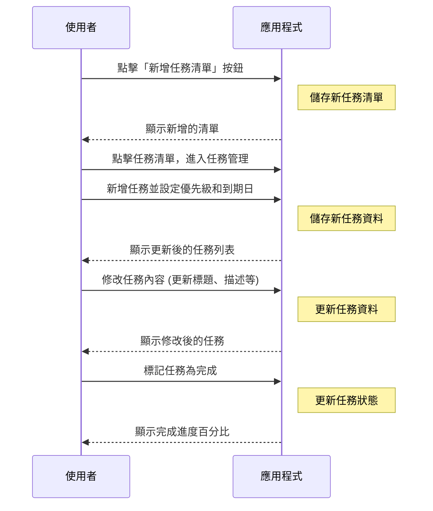

# Task-Tracking-App

## 專案介紹

此專案用意在於幫助使用者高效地管理和追蹤任務。
使用者可以創建不同的任務清單，每個清單中可以包含多個任務，
並能夠對任務進行編輯、刪除、標記為完成等操作。


## 專案架構

* 後端：使用 Spring Boot 作為後端框架，提供 RESTful API 來處理任務清單與任務的 CRUD 操作。後端負責處理資料儲存、內容認證等功能。
* 前端：使用 Vite 搭配 React 作為前端框架，構建用戶界面。前端負責與後端 API 進行數據交互，顯示任務清單與任務，並提供交互方式。
* 資料庫：利用 Docker 搭建 PostgreSQL 資料庫來儲存所有的任務與任務清單資料。


## 功能介紹
1. 任務清單管理：<br/>使用者可以創建、更新和刪除不同的任務清單，每個清單都可以包含多個任務，讓使用者可以根據專案或任務類型進行分類和管理。

2. 任務管理：<br/>在每個任務清單中，使用者可以新增、編輯或刪除任務。每個任務會包含標題、描述、截止日期和優先順序，並且可以標記為完成。

3. 任務追蹤：<br/>使用者可以查看任務的完成進度，幫助自己了解目前已完成的任務比例。


## 用戶流程



## 安裝步驟
### 前置準備：

* JDK (Java Development Kit)：確保安裝 JDK 21 版本
* Node.js：安裝 Node.js（建議版本 18 或以上）
* Git：安裝 Git，用於拉取專案代碼
* IDE：推薦使用 IntelliJ IDEA
* Docker：用於容器化資料庫環境

### 運行專案：

```
git clone https://github.com/y2kaug27th/Task-Tracking-App.git
cd Task-Tracking-App
docker-compose up
cd tasks-fe
npm install
npm run dev
```

### 後端設置：
1. 啟動 IntelliJ IDEA，開啟 Task-Tracking-App 資料夾
2. 等待 Maven 下載所有必要的依賴庫
3. 在專案目錄中找到 ```src\main\java\com\chenpinkao\tasks\TasksApplication.java```
4. 執行 ```TaskTrackingApplication.java```
5. 檢查後端是否正常運行
