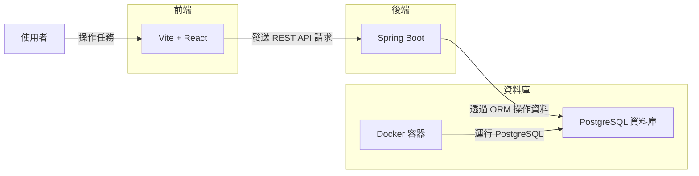

# Task-Tracking-App

## 專案介紹

此專案用意在於幫助使用者高效地管理和追蹤任務。
使用者可以創建不同的任務清單，每個清單中可以包含多個任務，
並能夠對任務進行編輯、刪除、標記為完成等操作。

## 系統架構圖


## 建構環境

* 前端：使用 Vite 搭配 React 作為前端框架，構建用戶界面。前端負責與後端 API 進行數據交互，顯示任務清單與任務，並提供交互方式。
* 後端：使用 Spring Boot 作為後端框架，提供 RESTful API 來處理任務清單與任務的 CRUD 操作。利用 ORM 來簡化資料庫操作，負責處理資料儲存、內容認證等功能。
* 資料庫：利用 Docker 搭建 PostgreSQL 資料庫來儲存所有的任務與任務清單資料。

※ 目前專案已完成前後端的 Dockerize，並透過 GitHub Actions 與 Docker Hub 建立 CI/CD 流程，確保程式能快速且穩定地部署。


## 功能介紹
1. 任務清單管理：<br/>使用者可以創建、更新和刪除不同的任務清單，每個清單都可以包含多個任務，讓使用者可以根據專案或任務類型進行分類和管理。

2. 任務管理：<br/>在每個任務清單中，使用者可以新增、編輯或刪除任務。每個任務會包含標題、描述、截止日期和優先順序，並且可以標記為完成。

3. 任務追蹤：<br/>使用者可以查看任務的完成進度，幫助自己了解目前已完成的任務比例。


## 用戶流程


## 安裝步驟
### 前置準備：

* Git：安裝 Git，用於拉取專案代碼
* Docker：安裝Docker，用於容器化運行環境

### 運行專案：
#### 方法一：於本地建構 Docker 映像檔

1. 開啟終端並輸入以下指令：
```
git clone https://github.com/y2kaug27th/Task-Tracking-App.git
cd Task-Tracking-App
docker build -t tasks-be:1.0.0 -f docker/backend/Dockerfile .
cd tasks-fe
docker build -t tasks-fe:1.0.0 -f ../docker/frontend/Dockerfile .
cd ..
docker compose up
```
2. 保持終端開啟，並在瀏覽器中訪問：```http://localhost:5173/```

#### 方法二：於 Docker Hub 拉取映像檔

1. 創建 ```docker-compose.yml``` ，並在檔案中添加以下指令：
```
services:
  db:
    image: postgres:latest
    ports:
      - "5432:5432"
    restart: always
    environment:
      POSTGRES_PASSWORD: password
  backend:
    image: y2kaug27th/tasks-be:latest
    ports:
      - "8080:8080"
    restart: always
    depends_on:
      - db
  frontend:
    image: y2kaug27th/tasks-fe:latest
    ports:
      - "5173:5173"
    restart: always
    depends_on:
      - backend
```
2. 開啟終端並輸入 ```docker compose up```
4. 保持終端開啟，並在瀏覽器中訪問：```http://localhost:5173/```
